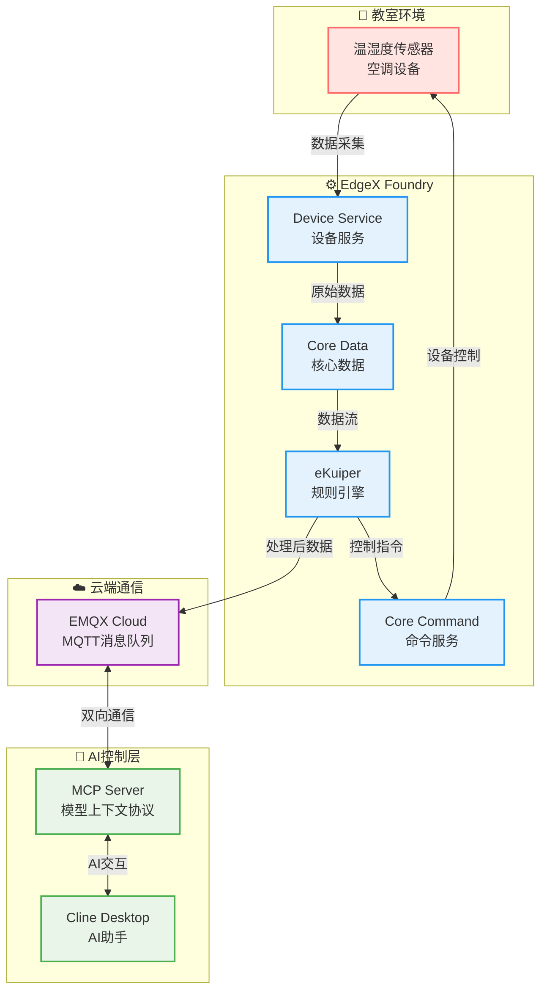

# 温度控制系统

本项目是一个基于edgex、mqtt、emqx-mcp-server的环境温度监控和空调控制系统，旨在通过cline客户端查询获知环境的温度和湿度，获取空调的状态，并且实现对空调的智能控制。

## 🌟 项目特点

- **虚拟设备**: 通过在classroom-device-profile.yaml配置文件，在EdgeX上注册虚拟设备，包括温度监控器、湿度监控器、空调三个虚拟设备，来获取相应的设备数据与状态。
- **智能控制**: 通过emqx-mcp-server与Cline，实现对空调的智能控制以及温度湿度的获取。由于原版的emqx-mcp-server只提供了基础工具，并不能实现项目功能，因此我在对应模块添加注册了几个工具，包括`get_temperature`，`get_humidity`，`get_ac_status`，`set_ac_power`，`set_ac_temperature`。
- **数据传输**: 使用eKuiper的过滤规则处理数据。本项目定义了两个流，分别从edgex和mqtt主题获取数据，并以此定义了对应的规则来进行查询和控制。
- **云端协同**: 借助EMQX Cloud作为mqtt broker实现可靠的消息传递。
- **模块化设计**: 系统分为EdgeX物联网处理模块和MCP服务器AI交互模块。

## 🏗️ 系统架构

系统主要由以下几个部分组成：



1. **感知层**: 虚拟传感器（通过EdgeX Device Virtual Service模拟）采集温度、湿度和空调状态。
2. **边缘层**:
    - `EdgeX Foundry`: 负责设备接入、数据采集、命令下发。
    - `eKuiper`: 边缘流处理引擎，执行数据转发、状态同步和初步的控制逻辑。
3. **云/通讯层**:
    - `EMQX Cloud`: 作为MQTT Broker，负责边缘与MCP服务器之间的消息传递。
4. **应用/AI层**:
    - `EMQX MCP Server`: 实现Model Context Protocol，作为AI模型与教室环境交互的桥梁。
    - `AI模型 (如Cline)`: 分析数据，做出智能决策，通过MCP Server下发控制指令。

## 📁 项目结构

```
Temperature-Control-System/
├── EdgeX_mqtt/                   # EdgeX Foundry, eKuiper及相关配置和脚本
│   ├── docker-compose.yml        # EdgeX服务编排
│   ├── config/                   # 设备档案、虚拟设备、eKuiper源配置
│   ├── rules/                    # eKuiper规则定义
│   ├── scripts/                  # 初始化、状态检查脚本
│   └── README.md                 # EdgeX模块详细说明
├── emqx-mcp-server-main/         # EMQX MCP服务器实现
│   ├── src/                      # MCP服务器源代码
│   ├── config/                   # Claude Desktop配置示例
│   └── README.md                 # MCP服务器模块详细说明
├── requirements.txt              # Python项目依赖 (主要用于MCP Server)
├── setup_environment.sh          # 环境初始化脚本 (创建虚拟环境、安装依赖)
├── start_temperature_control_v2.sh # 一键启动整个系统脚本
├── start_mcp_server.sh           # 单独启动MCP服务器脚本
├── stop_temperature_control.sh # 停止所有系统组件脚本
└── README.md                     # 本文件 - 项目总览
```

## 🛠️ 环境要求

- Docker 和 Docker Compose (用于运行EdgeX Foundry)
- Python 3.8+ (用于运行EMQX MCP Server)
- EMQX Cloud 账户 (或本地EMQX Broker)
- Claude Desktop (或其他支持MCP协议的AI客户端)
- macOS 或 Linux (脚本主要在此环境测试)

## 🚀 快速开始

### 1. 初始化环境

首次运行时，需要初始化Python虚拟环境并安装依赖：

```bash
./setup_environment.sh
```

### 2. 配置环境变量

根据需要，修改 `emqx-mcp-server-main/.env` 文件，配置EMQX Cloud的连接信息等。

### 3. 启动整个系统

此脚本会依次启动EdgeX Foundry容器、初始化eKuiper规则，并启动MCP服务器：

```bash
./start_temperature_control_v2.sh
```

### 4. 验证系统运行

- **EdgeX UI**: 访问 `http://localhost:4000` 查看设备状态和数据。
- **eKuiper**: 访问 `http://localhost:59720` (通过 `docker exec -it edgex-kuiper /bin/sh` 进入容器后使用 `kuiper` CLI) 查看流和规则状态。
- **MCP Server日志**: 查看项目根目录下的 `mcp_server.log`。
- **MQTT数据**: 使用MQTT客户端订阅相关主题 (如 `classroom/#`) 查看数据流。

### 5. 与AI模型交互

在Claude Desktop中配置并连接到本地运行的MCP Server，即可通过AI模型与温度控制系统进行交互，例如：

- "获取当前教室温度。"
- "把空调打开。"
- "设置空调目标温度为22摄氏度。"

### 6. 停止系统

```bash
./stop_temperature_control.sh
```

## ⚙️ 主要配置

- **EdgeX设备配置**: `EdgeX_mqtt/config/classroom-device-profile.yaml` 和 `EdgeX_mqtt/config/classroom-devices.toml`
- **eKuiper规则**: `EdgeX_mqtt/rules/` 目录下的JSON文件
- **MCP服务器配置**: `emqx-mcp-server-main/.env` 和 `emqx-mcp-server-main/src/emqx_mcp_server/config.py`
- **Claude Desktop连接配置**: `emqx-mcp-server-main/config/claude_desktop_config_temperature_control.json`

## 📖 详细文档

- **EdgeX与eKuiper模块**: 请参考 `EdgeX_mqtt/README.md`
- **EMQX MCP Server模块**: 请参考 `emqx-mcp-server-main/README.md`
