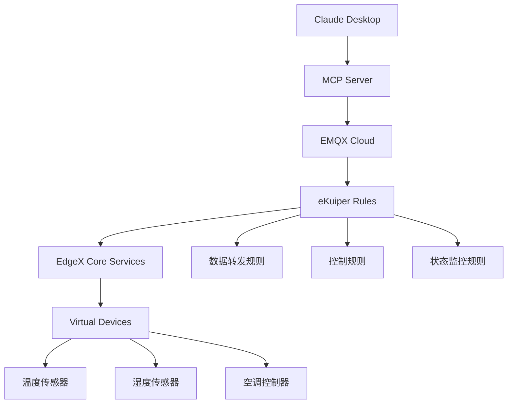

# EMQX MCP Server - 温度控制版本

[](https://smithery.ai/server/@Benniu/emqx-mcp-server)

基于 [原版 EMQX MCP Server](https://github.com/Benniu/emqx-mcp-server) 的温度控制系统定制版本。此版本专门为环境温度控制物联网环境进行了增强和优化，集成了EdgeX Foundry、eKuiper流处理引擎和EMQX Cloud服务。

## 🆕 与原版的主要变化

### 🌡️ 温度控制专用功能

| 功能模块 | 原版 | 温度控制版 | 说明 |
|---------|------|----------|------|
| **设备管理** | 通用MQTT客户端管理 | ✅ 温控设备专用管理 | 针对温湿度传感器、空调设备的专门工具 |
| **数据监控** | 基础消息订阅 | ✅ 实时环境监控 | 温度、湿度数据的持续监控和分析 |
| **设备控制** | 手动消息发布 | ✅ 智能空调控制 | 自动温度调节和空调开关控制 |

### 🔧 技术架构增强

**原版架构**:

```
Claude Desktop ↔ MCP Server ↔ EMQX Broker
```

**温度控制版架构**:

```
Claude Desktop ↔ MCP Server ↔ EMQX Cloud
                      ↕
              eKuiper Rules Engine
                      ↕
              EdgeX Virtual Devices
```

### 📊 新增功能对比

#### 🆕 温度控制专用工具 (新增)

1. **`get_temperature`** - 获取实时温度数据
2. **`get_humidity`** - 获取实时湿度数据
3. **`get_ac_status`** - 获取空调运行状态
4. **`set_ac_power`** - 空调开关控制
5. **`set_ac_temperature`** - 空调温度设置

#### 🔄 增强的原版功能

| 原版工具 | 温度控制版增强 |
|---------|---------------|
| `subscribe_to_topic` | ✅ 预设教室主题模式 |
| `publish_message` | ✅ 支持设备控制命令格式 |
| `get_client_list` | ✅ 过滤显示温控相关设备 |

## 🏗️ 系统架构

### 核心组件集成



### 数据流处理

1. **设备数据采集**: EdgeX虚拟设备生成传感器数据
2. **流数据处理**: eKuiper实时处理和规则引擎
3. **消息路由**: EMQX Cloud可靠消息传递
4. **AI交互**: MCP Server提供智能监控和控制接口

## 🚀 快速开始

### 1. 环境要求

- Python 3.8+
- EMQX Cloud账户或本地EMQX服务器
- EdgeX Foundry (通过Docker Compose)
- Claude Desktop

### 2. 安装步骤

```bash
# 克隆项目
cd emqx-mcp-server-main

# 安装依赖
pip install -e .

# 配置环境变量
cp .env.example .env
# 编辑 .env 文件，设置EMQX连接信息
```

### 3. 配置Claude Desktop

将以下配置添加到Claude Desktop配置文件：

```json
{
  "mcpServers": {
    "emqx-temperature-control": {
      "command": "python",
      "args": ["-m", "emqx_mcp_server"],
      "cwd": "/path/to/your/emqx-mcp-server-main",
      "env": {
        "EMQX_BROKER_HOST": "your-emqx-cloud-host.emqxsl.cn",
        "EMQX_BROKER_PORT": "8883",
        "EMQX_USERNAME": "your-username",
        "EMQX_PASSWORD": "your-password",
        "EMQX_USE_SSL": "true"
      }
    }
  }
}
```

### 4. 启动MCP服务器

```bash
python -m emqx_mcp_server
```

## 🎯 温度控制功能

### 🌡️ 环境监控

- **实时温度监控**: 自动获取环境温度数据
- **湿度监控**: 持续监控空气湿度变化
- **历史数据分析**: 温湿度趋势分析

### 🔧 设备控制

- **智能空调控制**: 根据温度自动调节空调
- **远程开关控制**: 一键开关空调
- **温度设定**: 精确设置目标温度

### 📊 数据分析

- **异常检测**: 自动识别温度异常情况
- **趋势预测**: 基于历史数据预测温度变化
- **节能建议**: 提供空调使用优化建议

## 📡 MQTT主题架构

### 监控主题 (订阅)

```
classroom/temperature/realtime     # 实时温度数据
classroom/humidity/realtime        # 实时湿度数据
classroom/ac/power/status          # 空调电源状态
classroom/ac/temperature/status    # 空调温度状态
```

### 控制主题 (发布)

```
classroom/ac/power/control         # 空调开关控制
classroom/ac/temperature/control   # 空调温度控制
```

## 🧪 测试和验证

### 单元测试

```bash
# 测试MQTT连接
python tests/test_mqtt_connection.py

# 测试MCP服务器
python tests/test_server.py
```

### 功能测试

```bash
# 测试温度获取
python -c "
from src.emqx_mcp_server.tools.temperature_control_tools import TemperatureControlTools
tools = SmartClassroomTools()
print(tools.get_temperature())
"
```

## 📁 项目结构

```
emqx-mcp-server-main/
├── src/emqx_mcp_server/
│   ├── __main__.py               # 程序入口
│   ├── server.py                 # MCP服务器核心
│   ├── config.py                 # 配置管理
│   ├── emqx_client.py           # EMQX客户端
│   └── tools/                    # MCP工具模块
│       ├── temperature_control_tools.py  # 🆕 温度控制工具
│       ├── emqx_client_tools.py      # 客户端管理工具
│       ├── emqx_message_tools.py     # 消息处理工具
│       └── emqx_subscription_tools.py # 订阅管理工具
├── config/
│   └── claude_desktop_config_temperature_control.json  # 🆕 Claude配置
└── tests/                        # 测试文件
```

## 🔧 配置选项

### 环境变量

```bash
# EMQX连接配置
EMQX_BROKER_HOST=your-emqx-host
EMQX_BROKER_PORT=8883
EMQX_USERNAME=your-username
EMQX_PASSWORD=your-password
EMQX_USE_SSL=true

# 教室配置
CLASSROOM_ID=classroom_01
CLASSROOM_TOPIC_PREFIX=classroom
TEMPERATURE_ALERT_HIGH=28.0
TEMPERATURE_ALERT_LOW=18.0
```

### 高级配置

- **消息缓存**: 配置历史消息保留数量
- **重连策略**: 自定义MQTT重连间隔
- **告警阈值**: 设置温湿度告警阈值

## 🔗 相关项目

- **原版项目**: [Benniu/emqx-mcp-server](https://github.com/Benniu/emqx-mcp-server)
- **EdgeX Foundry**: [EdgeX Foundry官方网站](https://www.edgexfoundry.org/)
- **eKuiper**: [LF Edge eKuiper](https://ekuiper.org/)
- **EMQX Cloud**: [EMQX Cloud平台](https://cloud.emqx.com/)

## 📄 开源协议

本项目基于原版项目的开源协议。详见 [LICENSE](LICENSE) 文件。
  
**基于**: [emqx-mcp-server](https://github.com/Benniu/emqx-mcp-server) 原版  
